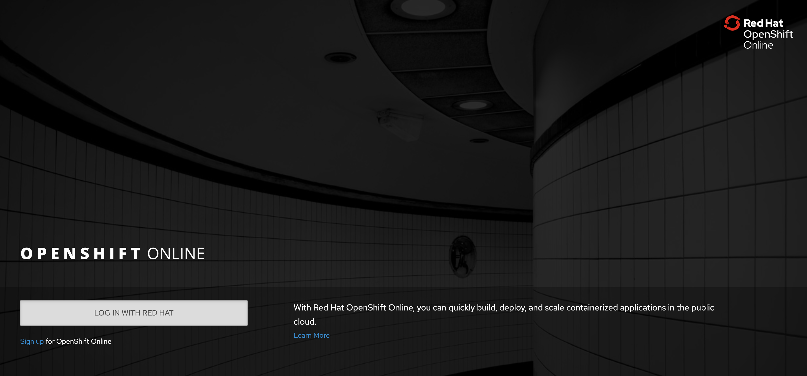
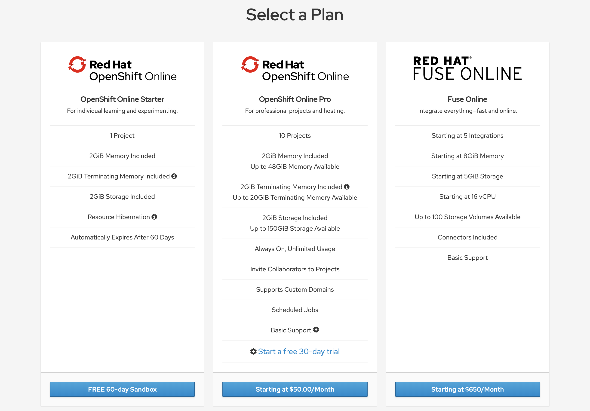
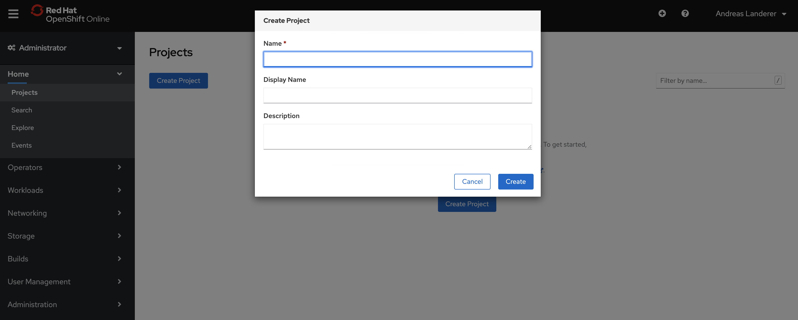
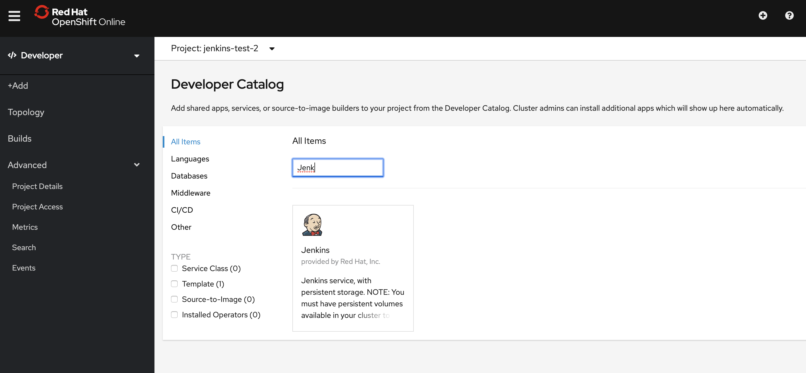
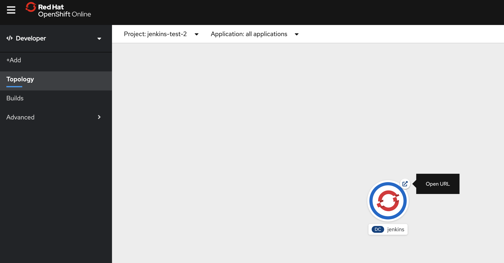
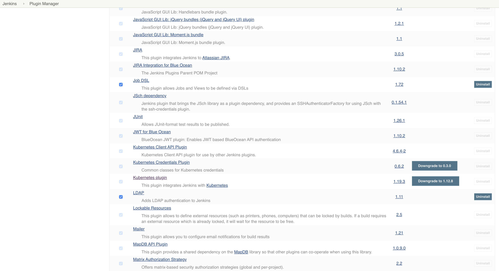
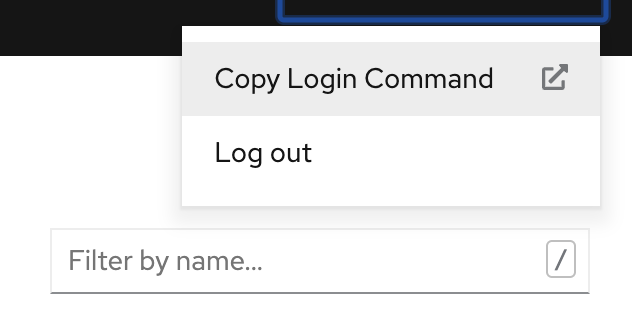

# DevOps with OpenShift in practice

This repository contains all the instructions that you should execute 
if you want to participate actively in our workshop "DevOps with OpenShift 
in practice" at DevOps Fusion 2020.

If you want to learn more about our workshop, click on this 
[link](https://www.devops-fusion.com/en/program/).

Throughout these instructions, we will show you how to set up an online 
OpenShift cluster, how to install a managed Jenkins server in that cluster, 
and where to find the git project we will be working on in the workshop to 
implement a CI/CD pipeline.

## Setting up an online OpenShift cluster

For the workshop, we want to leverage the OpenShift online platform. This 
platform provides a fast and easy way to set up an OpenShift cluster in 
the cloud. Goto [manage.openshift.com](https://manage.openshift.com/) to
create your cluster.  

To use the OpenShift online platform, you need a RedHat account. If you 
don't have an account yet, you can create one by clicking on 
__Sign up for OpenShift Online__ on the lower left-hand side of the page. 
To verify your account, RedHat will ask you to provide an email address 
and your cell phone number. 

Afterward, you can select the __60-day sandbox__ from the plans offered by 
RedHat. This plan is sufficient to follow along with our workshop, and RedHat 
will not charge you after this period.

It will take a few minutes until your cluster is successfully provisioned and 
ready to use. Once your cluster has been provisioned, open the web console to 
access OpenShift online.

## Creating a new OpenShift project

The first thing you should do after entering the OpenShift web console is to 
create a new project. You can choose an appropriate name for your project. 
However, this name must be globally unique.

## Setting up a managed jenkins instance

After your project is ready, you can set up a Jenkins that runs within a pod 
in OpenShift. Therefore, you should switch to the __Developer__ perspective 
and click on __+Add__ on the left-hand side of the page. From the __Catalog__ 
tile, choose Jenkins and initiate the creation of a new instance. 

To login to your newly create Jenkins instance, switch to the __Topology__ 
section and click on the arrow on the top-right of the icon to open the Jenkins 
user interface.

## Updating the Kubernetes Jenkins plugin

Within the __Manage Plugins__ section under __Manage Jenkins__, we recommend 
that you update the Kubernetes Jenkins plugin to avoid issues with provisioning
new Jenkins slaves. As of creating these instructions, we made use of version 
1.19.3, which worked fine for us.
 
 

## Forking our git repository

One more thing you should do to prepare for our workshop is to __fork__ our 
[GitHub Repository](https://github.com/cicd-with-openshift-at-devopsfusion/workshop) 
Afterward, feel free to clone it. This is necessary since you will modify the 
Jenkins pipeline throughout the workshop and push these changes back to the 
remote repository. So make sure to have a local __git installation__ and 
a __text editor__ or IDE of your choice at hand. 
In addition to that, you need access to __GitHub__ to push your changes.
## Installing OC tools

The last thing you need to do to be prepared for our workshop is to install 
the OpenShift client tools. You can retrieve them from the 
[Open Source Kubernetes Distribution page](https://www.okd.io/download.html). 
Scroll down a little bit until you reach __Download oc Client Tools__. 
Choose the package for your operating system and follow these instructions: 
[Installing the CLI](https://docs.okd.io/latest/cli_reference/get_started_cli.html#installing-the-cli) 
 
 ## Connecting to your OpenShift cluster
 
Once you successfully installed the client tools, let's quickly check that 
you can connect to your OpenShift cluster. First, go back to the OpenShift 
web console, and on the top-right of the page, click the small arrow next to 
your user name. Next, a click on __Copy Login Command__ should open up a new 
web page with a single link: __Display Token__. 

 

This link will create a new  API token and a complete __oc login__ command. 
Copy that command and paste it into a terminal in your notebook. 
You should be able to connect to your cluster and see the message 
__Using project "my-project".__ where my-project  stands for the name of your 
OpenShift project. 
 
__Congratulations, you're all set! We're looking forward to seeing you at our 
workshop.__